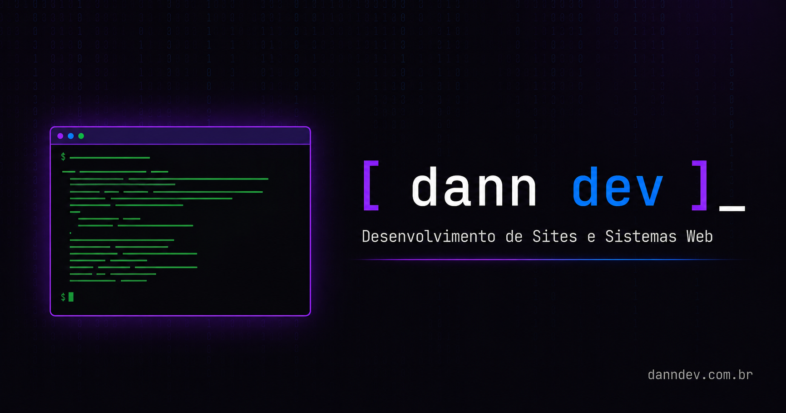

<p align="center">
  
</p>

<p align="center">
  
  
  
  
</p>

---

# [ dann dev ]_

**Desenvolvimento de Sites e Sistemas para Comércios**  
Portfólio profissional do danndev — transformando visitantes em clientes.

## 🚀 Sobre

Site portfólio freelancer com tema **hacker/cyberpunk** (preto, roxo, azul).  
Feito do zero, sem frameworks ou build steps — **vanilla HTML, CSS e JavaScript**.

### Seções

- **Hero** — Apresentação com Typed.js + terminal animado + stats
- **Serviços** — Site Institucional, Landing Page, Sistema Web (cards com VanillaTilt)
- **Diferenciais** — Por que escolher o danndev
- **Projetos** — Portfólio de entregas
- **Processo** — Como funciona o desenvolvimento
- **FAQ** — Dúvidas frequentes (accordion)
- **Contato** — Formulário + WhatsApp + redes sociais

## 🛠 Stack

| Tecnologia | Uso |
|---|---|
| **HTML5** | Estrutura semântica, acessibilidade (ARIA), SEO (Open Graph, JSON-LD) |
| **CSS3** | Design responsivo, tema cyberpunk, animações (scroll reveal, glow, terminal) |
| **JavaScript (Vanilla)** | Matrix canvas, Typed.js, VanillaTilt, tsParticles, accordion FAQ, ticker infinito, formulário WhatsApp |
| **Cloudflare Pages** | Hospedagem, CDN, cache, redirects, headers de segurança |

### Bibliotecas (CDN)

- [tsParticles v2](https://particles.js.org/) — Partículas no hero
- [Typed.js](https://github.com/mattboldt/typed.js/) — Efeito de digitação
- [VanillaTilt](https://github.com/micku7zu/vanilla-tilt.js/) — Inclinação 3D nos cards
- [Lucide Icons](https://lucide.dev/) — Ícones SVG

## 📂 Estrutura

```
danndev/
├── index.html            # Página principal
├── css/style.css         # Estilos
├── js/main.js            # Scripts
├── danndev.png           # Imagem Open Graph (compartilhamento)
├── icon.png              # Favicon
├── _headers              # Configuração de cache e segurança (Cloudflare)
├── _redirects            # Redirecionamento www → apex
├── robots.txt            # Regras para crawlers
├── sitemap.xml           # Mapa do site para SEO
└── README.md             # Você está aqui
```

## 🌐 Deploy

Hospedado no **Cloudflare Pages**:

1. Conecte o repositório no Cloudflare Pages
2. Branch: `main` | Pasta raiz: `/`
3. Domínio: `danndev.com.br`
4. Pronto ✅

Os arquivos `_headers` e `_redirects` são reconhecidos automaticamente pelo Cloudflare — **zero configuração extra**.

## 📱 Redes

- [Instagram — @danndev_](https://www.instagram.com/danndev_/)
- [LinkedIn — danndev](https://www.linkedin.com/in/danndev/)
- [GitHub — Lprdan](https://github.com/Lprdan)
- [WhatsApp — (11) 94262-3115](https://wa.me/5511942623115)

---

<p align="center">
  Feito com 💜 e café<br>
  <sub>danndev — todos os direitos reservados</sub>
</p>
